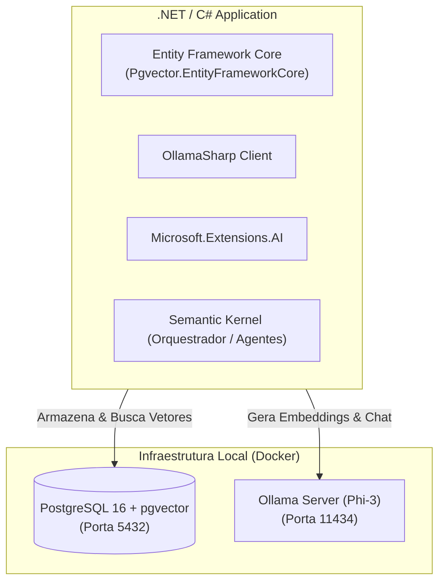

# 🧠 Arquitetura de IA Local & Busca Vetorial em C# / .NET

Visão geral da arquitetura do treinamento prático da plataforma **balta.io** integrando PostgreSQL com `pgvector`, Ollama (Phi-3), Entity Framework Core e Semantic Kernel.

---

## 1. Visão Geral da Stack

---

## 2. Componentes da Solução

### 1. Banco de Dados com Suporte a Vetores (PostgreSQL + pgvector)
- **Extensão:** `pgvector`
- **Tipos de dados:** Coluna `vector(dimensao)`
- **Operadores de Similaridade:**
  - `<=>` Distância de Cosseno (mais comum para embeddings de texto)
  - `<->` Distância Euclidiana (L2)
  - `<#>` Produto Escalar Negativo

### 2. LLM e Modelo de Embeddings Local (Ollama + Phi-3)
- O modelo `phi3` é executado sem necessidade de chaves de API pagas ou conexão com a nuvem.
- Ideal para prototipagem rápida, ambientes corporativos isolados e controle total sobre a privacidade dos dados.

### 3. Integração com C# (.NET)
- **OllamaSharp:** Cliente nativo C# para interagir diretamente com a API do Ollama.
- **Microsoft.Extensions.AI / VectorData:** Abstrações unificadas da Microsoft para modelos de IA e lojas de vetores, facilitando a troca entre provedores locais e em nuvem (Azure OpenAI, AWS Bedrock, Ollama).
- **Semantic Kernel:** Orquestração de prompts, memórias semânticas, plugins nativos e criação de agentes autônomos.
- **Entity Framework Core:** Mapeamento objeto-relacional com suporte a consultas semânticas fortemente tipadas com `Pgvector.EntityFrameworkCore`.
